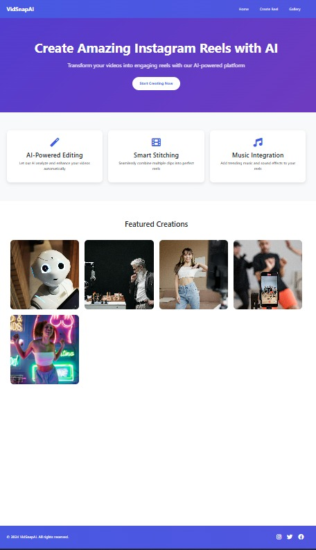
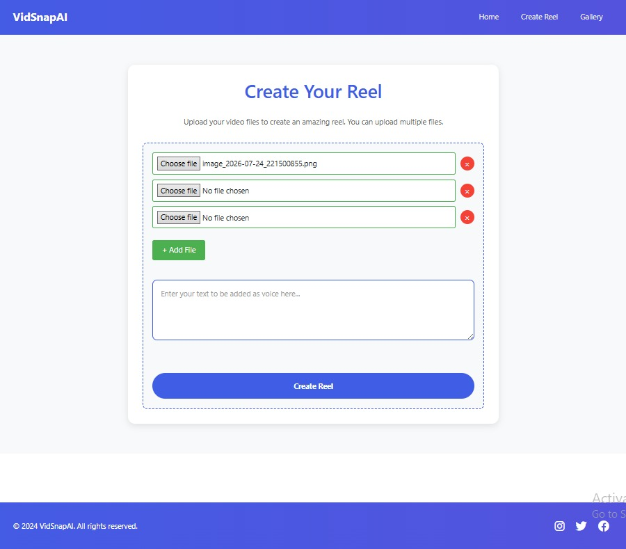
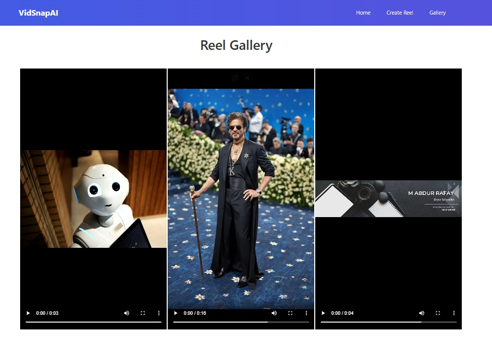

<div align="center">

# 🎬 VidSnap AI

### AI-Powered SaaS for Automated Reel Generation

Turn your **images** and **text** into engaging, AI-narrated reels in just a few clicks.

<p>


</p>

**Create professional reels automatically using AI voice synthesis and FFmpeg.**

⭐ Don't forget to star this repository if you find it useful!

</div>

---

# ✨ Overview

VidSnap AI is an AI-powered Flask web application that automates the creation of short-form videos.

Simply upload your images, enter a script, and let the application do the rest.

Behind the scenes, VidSnap AI:

- 📂 Creates a unique project directory using UUID.
- 📝 Stores the user's script as `desc.txt`.
- 🖼 Saves uploaded images.
- 🎞 Generates an FFmpeg-compatible `input.txt`.
- 🔊 Converts the script into a realistic AI voice using ElevenLabs.
- 🎬 Combines images and narration into a professional reel using FFmpeg.
- 🖼 Displays generated videos inside a built-in gallery.

---

# 📸 Preview

## 🏠 Home Page

<p align="center">

</p>

---

## 🎥 Create Reel

<p align="center">

</p>

---

## 🖼 Gallery

<p align="center">

</p>

---

# 🚀 Features

- 🎬 Automatic AI Reel Generation
- 🖼 Upload Multiple Images
- 📝 Custom Story/Script Input
- 🔊 AI Voice Generation using ElevenLabs
- 🎵 Automatic MP3 Voiceover Creation
- 🎞 FFmpeg Video Rendering
- 📂 UUID-based Project Organization
- 📁 Automatic Asset Management
- 🖥 Responsive Flask Web Interface
- 🖼 Built-in Gallery
- ⚡ Fast Processing Pipeline

---

# ⚙️ How It Works

```text
               User
                 │
     ┌───────────┴───────────┐
     │                       │
 Upload Images          Enter Script
     │                       │
     └───────────┬───────────┘
                 ▼
        Generate UUID Folder
                 │
        ┌────────┼────────┐
        │        │        │
        ▼        ▼        ▼
 Save Images  desc.txt  input.txt
                 │
                 ▼
        ElevenLabs API
        (Text → Speech)
                 │
                 ▼
            audio.mp3
                 │
                 ▼
             FFmpeg
(Image Sequence + Audio)
                 │
                 ▼
          output.mp4
                 │
                 ▼
        Gallery & Download
```

---

# 📂 Project Structure

```text
ProjectVidSnapAI/

│
├── main.py
├── generate_process.py
├── text_to_audio.py
├── config.py
│
├── templates/
│   ├── base.html
│   ├── index.html
│   ├── create.html
│   └── gallery.html
│
├── static/
│
├── user_uploads/
│    └── UUID/
│         ├── desc.txt
│         ├── image1.jpg
│         ├── image2.jpg
│         ├── image3.jpg
│         ├── input.txt
│         ├── audio.mp3
│         └── output.mp4
│
└── README.md
```

---

# 🧠 Internal Processing Pipeline

Each reel is generated inside its own isolated workspace.

Example:

```text
7d33cb74-f7d5-4bc7-9dc0-e1f42fdd2d39/

├── desc.txt
├── image1.jpg
├── image2.jpg
├── image3.jpg
├── input.txt
├── audio.mp3
└── output.mp4
```

This architecture allows multiple reels to be generated without file conflicts.

---

# 🛠 Tech Stack

| Technology | Purpose |
|------------|----------|
| Python | Backend |
| Flask | Web Framework |
| HTML5 | Frontend |
| CSS3 | Styling |
| JavaScript | Client-side Interaction |
| Jinja2 | Template Engine |
| ElevenLabs API | AI Voice Generation |
| FFmpeg | Video Rendering |
| UUID | Unique Project Management |

---

# 💻 Installation

Clone the repository

```bash
git clone https://github.com/A6dur/ProjectVidSnapAI.git
```

Navigate into the project

```bash
cd ProjectVidSnapAI
```

Install dependencies

```bash
pip install -r requirements.txt
```

Configure your API keys

```python
ELEVENLABS_API_KEY="YOUR_API_KEY"
```

Run the application

```bash
python main.py
```

Open your browser

```
http://127.0.0.1:5000
```

---

# 🔐 Configuration

For security reasons, API keys should **never** be committed to GitHub.

Store your credentials in a local configuration file or environment variables and add them to `.gitignore`.

Example:

```python
ELEVENLABS_API_KEY="YOUR_API_KEY"
```

---

# 🌟 Why VidSnap AI?

Creating short-form videos manually requires multiple tools for scripting, voice generation, editing, and rendering.

VidSnap AI simplifies the entire workflow by combining AI narration with automated video rendering into one streamlined web application.

Whether you're creating educational content, motivational reels, or social media posts, VidSnap AI dramatically reduces the time required to produce professional-looking videos.

---

# 🚀 Future Improvements

- 🤖 AI Script Generation
- 🌍 Multiple Voice Languages
- 🎵 Background Music Selection
- 🎨 Video Transitions
- 📱 Mobile Responsive Design
- ☁ Cloud Storage Integration
- 👤 User Authentication
- 📊 Project Dashboard
- 📜 Automatic Subtitle Generation
- 🎥 Multiple Video Aspect Ratios

---

# 🤝 Contributing

Contributions are welcome!

If you'd like to improve VidSnap AI, feel free to fork the repository, create a new branch, and submit a Pull Request.

---

# 👨‍💻 Developer

### **Abdur Rafay**

Software Engineering Student

GitHub: https://github.com/A6dur

---

<div align="center">

## ⭐ Support

If you enjoyed this project, consider giving it a **⭐ Star**.

It helps others discover the project and motivates future improvements.

---

Made with ❤️ using **Flask**, **ElevenLabs**, and **FFmpeg**

</div>